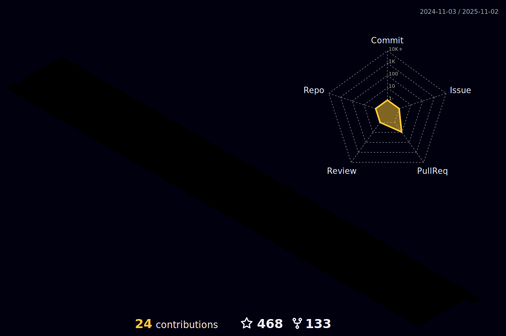

<!--
**lannguyen0910/lannguyen0910** is a ✨ _special_ ✨ repository because its `README.md` (this file) appears on your GitHub profile.

Here are some ideas to get you started:

- 🔭 I’m currently working on ...
- 🌱 I’m currently learning ...
- 👯 I’m looking to collaborate on ...
- 🤔 I’m looking for help with ...
- 💬 Ask me about ...
- 📫 How to reach me: ...
- 😄 Pronouns: ...
- ⚡ Fun fact: ...
-->

<!-- <h3 align="center">
        <samp>  Welcome to
                <b> Hoang-Lan Nguyen's profile  </b>
        </samp>
</h3>
  -->

<h4 align="center">👋 Hi, I’m Hoang-Lan. I’m a Master's student in Germany, formerly an apprentice Data Engineer.</h4>
<h4 align="center">🔭 I’m interested in data engineering, cloud computing, machine learning, and deep learning.</h4>
<h4 align="center">📫 My email: <a href="mailto:nhlan091000@gmail.com">nhlan091000@gmail.com</a>.</h4>

<h4 align="center">🙋‍♂️ More about me: ✨ https://lannguyende.com/ ✨</h4>

	

<!-- Social badges section -->
<!-- Badges with custom icons - https://github.com/DenverCoder1/custom-icon-badges -->
<!-- YouTube stats - https://github.com/DenverCoder1/github-readme-youtube-stats -->
<!-- View counter - https://github.com/DenverCoder1/Simple-View-Counter -->
<!-- Star counter - https://github.com/idealclover/GitHub-Star-Counter -->
<!--  -->

  
  
	

	<h2>👨‍💻 Tech stacks</h2>
	  
	
	
	
	
	
	
	
		
	
	
	
	
	

<h2 align="center">👨‍🏫 Profile 3D</h2>

<!-- Details Section-->
 

    
 <samp>&#9776; Read More</samp>

    

	 <a><h2>🏆 Trophies</h2></a>
	

	    
<a><h2>:chart_with_upwards_trend: My Github Stats</h2></a>

	

  

</a>

<a href="https://github.com/lannguyen0910/food-detection-yolov5">
  
	

	

---

<a><h2>:crossed_swords: Activities</h2></a>

---
	

<a><h2>:telephone_receiver: Contact me at </h2></a>

  

	
	
	

